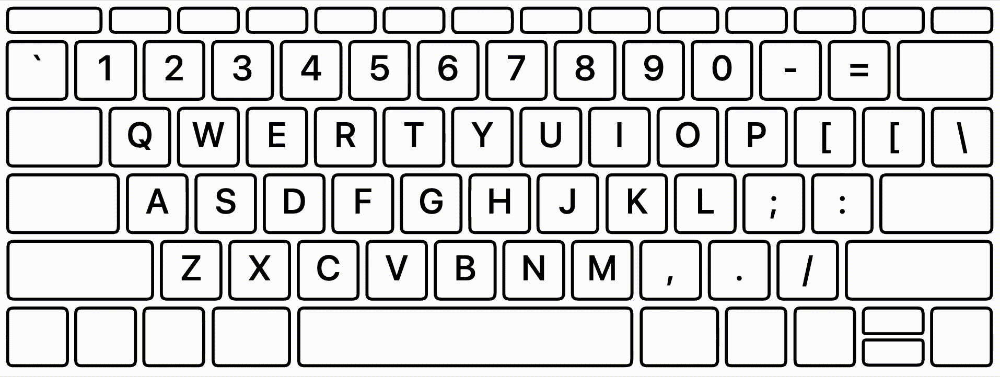
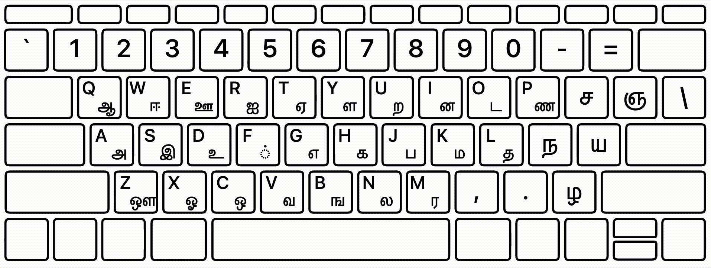
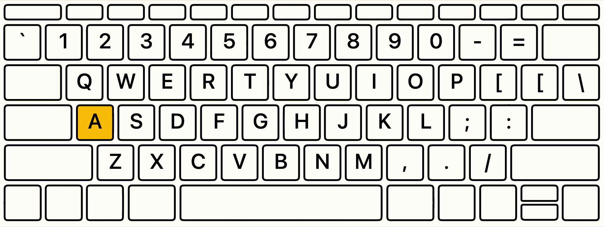

# ⌨️ International Keyboards
*JS/SVG keyboard layout visualization for 93 languages 🏳️*

**TD;DR**: Keyboards look different across the globe. This package allows to render the right keyboard layout. 🌎 [Check out the demo](https://polvanrijn.github.io/international-keyboards/index.html)

## API
This is a small JS library to render keyboard layouts for different languages. 
```{javascript}
var keyboard = new InternationalKeyboard({
    keyboardID: 'German',
    containerID: 'keyboard',
    keyboardType: 'ISO',
    
    // optional
    // cssStyle: 'inverted', // 'inverted', 'default', 'apple'
    // showKeys: ['KeyA', 'KeyL'], // default: all keys
    // keyVariant: 'lower', // 'lower', 'upper'
    // addLatinKeys: true, // default: false
});
```

You can select from three styles: `inverted`, `default`, `apple`:


Furthermore you can highlight keys using:
```{javascript}
keyboard.highlight('KeyA');
```

Simulate a button press, hold and release:
```{javascript}
keyboard.press('KeyA');
keyboard.hold('KeyA');
keyboard.release('KeyA');
```



## Motivation
I am interested in running online experiments across the globe. For speedy responses, it is useful to use the keyboard 
instead of the mouse. To explain the task to the participant, it is handy to display the keyboard, however, keyboards 
look different on different places in the world. For example, the key <kbd>Y</kbd> is positioned in the lower left part 
of the keyboard on a German QWERTZ keyboard, where it's in the upper middle on an US QWERTY keyboard. This problem 
becomes even more apparent when you think about non-latin languages, such as Russian, Chinese, or Arabic. 

### Design choices
- Here we identify keys using key codes which uses a US keyboard layout as a reference, see [KeyboardEvent](https://developer.mozilla.org/en-US/docs/Web/API/KeyboardEvent/keyCode).
- We only support a compact keyboard as it is available on all computers (including laptops).
- The keyboard layout is inspired by the Mac design, see [Apple Keyboard](https://support.apple.com/en-us/HT201794), but it can easily be ported to the Windows design.
- While there are [many different physical keyboard layouts](https://en.wikipedia.org/wiki/Keyboard_layout#Physical_layouts), we only support the most common ones. Which are ANSI, ISO and Japanese:
- However, since I don't own a Japanese keyboard I was only able to position keys other than digits and letters.

|  | ANSI | ISO | Japanese |
| ---  | --- | --- | --- |
| **Enter key**  |  |  |  |
| **Supported** | ✅ | ✅ | ⚠️ limited support|

### Keyboard extraction
- SVGs are drawn for the three keyboard types and keys are mapped onto the US keyboard layout.
- All Apple keyboard layouts are extracted using [Ukelele](https://software.sil.org/ukelele/).
- We extract the mapping using [keyboard-layouts](https://github.com/adobe-type-tools/keyboard-layouts) in `convert_keylayout_to_json.py`.

### Disclaimer
The conversion from the US keyboard layout to the other layouts is not perfect. It would be great if you can suggest fixes in the JSON files via pull requests.
